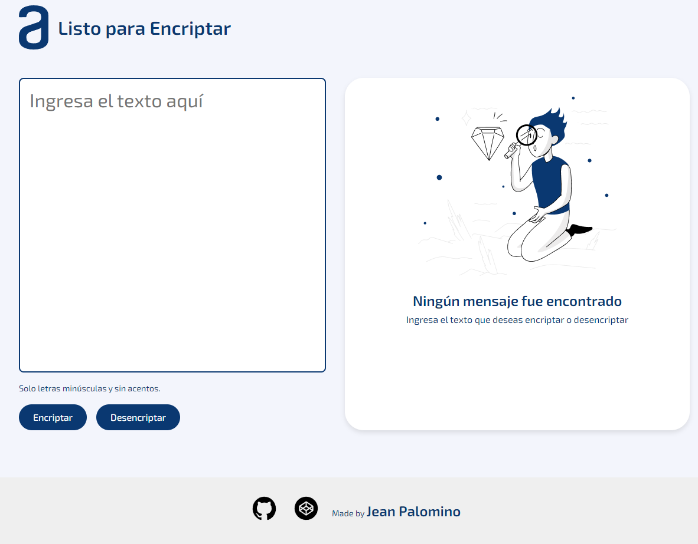

# Encriptador-de-texto


#Challengealura
Encriptador de texto encripta vocales a e i o u 

¡Bienvenidas y bienvenidos a nuestro primer desafío!

Durante estas cuatro semanas, vamos a trabajar en una aplicación que encripta textos, así podrás intercambiar mensajes secretos con otras personas que sepan el secreto de la encriptación utilizada.

Las "llaves" de encriptación que utilizaremos son las siguientes:

``` La letra "a" es convertida para "ai" ``` <br>
``` La letra "e" es convertida para "enter" ``` <br>
``` La letra "i" es convertida para "imes" ``` <br>
``` La letra "o" es convertida para "ober" ``` <br>
``` La letra "u" es convertida para "ufat" ``` <br><br>

### __Requisitos:__
- Funciona solo con letras minúsculas
- No deben ser utilizados letras con acentos ni caracteres especiales
- Debe ser posible convertir una palabra para la versión encriptada también devolver una palabra encriptada para su versión original.

Por ejemplo:
``` "gato" => "gaitober" ``` | ``` "gaitober" => "gato" ``` <br><br>
## Prototipo web




